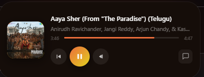

# Vivaldi Dynamic Island
*(An AI-Vibecoded UI Mod powered by Antigravity 2.0)*

  

## The Reality Check (How this was actually built)
I am a 2nd-year engineering student specializing in CS, IoT, and Cybersecurity. I openly dislike frontend development. **I did not write the HTML/CSS/JS syntax for this project.** Instead, I used this project to test the limits of agentic AI (Google's Antigravity 2.0). I acted as the System Architect, Product Manager, and QA Tester. I defined the logic, architected the features, diagnosed complex Chromium engine bugs, and wrangled Windows file paths, while the AI generated the raw code based on my iterative debugging. 

This repository is an artifact showing how far you can push a desktop browser using AI-assisted development.
*(This is a vibecoded mess and you will encounter bugs so beware of that)*

## Features
* **Native Browser UI:** Bypasses standard Chrome Extension sandboxes. The Island lives directly in Vivaldi's native title bar, meaning it works globally across all tabs (even settings and new tab pages).
* **Apple Music-Style Lyrics:** Features a drop-down, glassmorphism floating panel with time-synced, interactive `.lrc` lyrics. Click any lyric to instantly seek the track.
* **Smart UI States:** Automatically morphs from a collapsed pulsing pill to an expanded control center with high-res album art based on hover states and active audio output.
* **Main-World API Injection:** Zero-lag playback controls that bypass standard UI throttling.

## The Technical Hurdles Conquered
Getting this to work required solving several deep system and browser-engine quirks:

**1. The YouTube Music "Two-Video" Offset Bug**
YouTube Music is notoriously difficult to scrape. It simultaneously loads both the audio track and the full music video into the background, cropping the time mathematically via JS. Standard `<video>` tag scraping pulled wildly incorrect durations. 
* *The Fix:* Engineered a DOM scraper that reads the logical text from the UI itself (e.g., `0:06 / 3:59`) and compares it against the physical video element to calculate exact mathematical time offsets for seeking.

**2. Defeating Chromium Background Tab Throttling**
Initially, skipping tracks took 1-2 seconds. Chromium violently throttles JS execution in background tabs to save CPU. 
* *The Fix:* Ripped out standard UI-click simulations and implemented Main-World Injection. The mod now injects a script directly into YouTube's main context, bypassing the UI entirely and natively triggering the core `movie_player.nextVideo()` engine for zero-latency control.

**3. Bypassing Windows Registry & Path Locks**
Standard installation attempts caused Vivaldi's Crashpad to self-destruct due to hidden Administrator ghost processes holding named pipes hostage.
* *The Fix:* Built a custom PowerShell installer (`install.ps1`) wrapped in a Windows Batch script that safely isolates the installation, force-kills background Chromium tasks, backs up Vivaldi's core `browser.html`, injects the mod, and proxies `explorer.exe` to relaunch the browser without triggering elevation blocks.

## Installation
*Because this modifies the core browser UI, it cannot be distributed via the Chrome Web Store.*

1. Close Vivaldi.
2. Clone or download this repository.
3. Right-click `UPDATE (Run as Admin).bat` and run it as an Administrator.
4. The script will automatically locate your Vivaldi installation, inject the custom `dynamic-island.js` directly into `browser.html`, and safely relaunch the browser.

*(Note: You will need to re-run the script whenever Vivaldi pushes a major browser update, as updates overwrite core HTML files.)*

## Contributions
This codebase is a product of AI "vibecoding" and aggressive iterative prompting. If you are a dedicated frontend developer who wants to clean up the CSS transitions, optimize the JS event listeners, or fix any edge-case bugs, Pull Requests are highly welcome!
