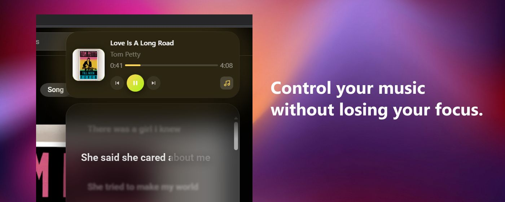
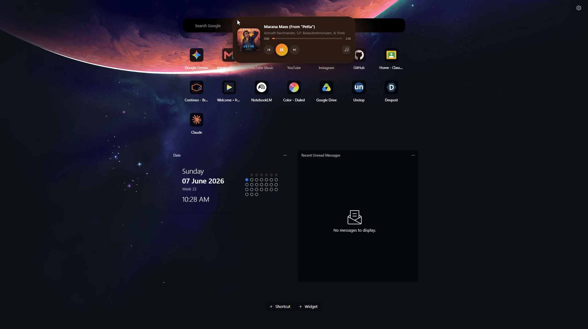
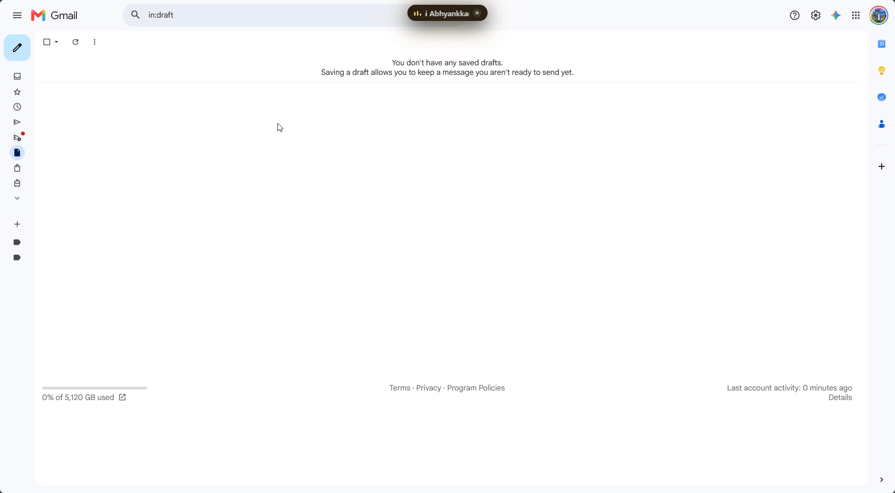

# Dynamic Island for Browsers (V1.5) 
*(Now supporting Apple Music, Spotify Web, YouTube, and YouTube Music)*

**🎉 Now officially available on the [Microsoft Edge Add-ons Store](https://microsoftedge.microsoft.com/addons/detail/jhglafdjkeohejcgfdmcfhenniahjgpk)!** *(Currently V1.2, V1.3 pending review)*

<p align="center">
  
</p>

A browser mod (and Chrome Extension) that brings an Apple-style Dynamic Island to your desktop browser, syncing with whatever media tab is playing in the background. (Currently supports **Apple Music**, **Spotify Web**, **YouTube**, & **YouTube Music**).

There are two versions:

- **Vivaldi Mod** — lives natively in Vivaldi's title bar, works across every tab including settings and new tab pages. Looks and feels like it belongs there.
- **Chrome Extension** — works on Chrome, Edge, Brave, or any Chromium browser. Sits as a fixed overlay at the top of every webpage. Less native-looking, but anyone can install it in 30 seconds without touching their browser's internals.

## In Action 🎬

### Vivaldi — Native title bar mod


### Chrome / Edge — Unpacked extension


### Spotify Web Integration


## Screenshots 📸

<p align="center">
  
  
</p>

---

## What's New in V1.5 🚀

- **Apple Music Sandbox Escape**: The island now fully supports `music.apple.com`! Apple Music is notoriously hostile to browser extensions, utilizing strict Content Security Policies and React synthetic event traps to block automated clicks. We engineered a native "Dual-World API Bypass" that punches a hole through Manifest V3, injecting our payloads directly into Apple's internal `MusicKit JS` engine to hijack control of their player seamlessly.
- **Spotify Lyrics Sync Perfected**: Rewrote the Spotify lyrics tracking engine to completely ignore their 8-second looping Canvas videos, mathematically extracting true duration exclusively from the primary Widevine audio buffer.
- **Dual-World Architecture Upgrade**: The entire core engine has been upgraded to support dual-world execution, allowing the island to instantly adapt its execution strategy based on the host website's security policies.

## What's New in V1.4 🚀

- **Spotify Web Integration**: The island now fully supports `open.spotify.com`! It automatically extracts the current track, artist, album art, duration, and live time. You can also play, pause, and seek flawlessly using our custom robotic-mouse DOM manipulation.
- **Deep-Media Timer Sync**: Solved severe timer desynchronization bugs caused by Spotify's DRM MSE chunking buffers and 8-second Canvas background videos. The Island now penetrates the DOM to extract true millisecond precision directly from the active audio tags while mathematically filtering out hidden looping visual elements.
- **Micro-Stutter Latency Fix**: Eradicated an issue where the background script's polling latency caused the Island's 60FPS UI progress bar to violently jitter back and forth. The Island now natively compensates for cross-process communication delays.
- **Absolute Logic Isolation**: We rebuilt the core engine to strictly partition media platforms. This mathematically guarantees that the new Spotify integration will *never* interfere with or break our highly-tuned YouTube and YouTube Music logic!
- **Gapless Playback Fix**: Fixed a major bug where YouTube Music's hidden gapless playback buffer caused the island's time tracking to desync and violently jitter. The 60FPS sync engine now smoothly bridges these buffer gaps.
- **Drag & Drop Persistence**: Fixed an issue where free-dragged positions wouldn't save correctly. If you drag the island to a custom spot on your screen, it will now correctly remember that exact position.
- **File Minification**: The extension is now heavily minified, drastically shrinking the core file size for snappier loading times and a lighter memory footprint!

## What's New in V1.3 🚀

- **Multi-Provider Lyrics Engine**: Fetches lyrics from both LyricsPlus and LRCLib simultaneously.
- **Glassmorphic Provider Menu**: A sleek, interactive UI menu to swap between lyrics providers on the fly.
- **Smart Fallback**: The island intelligently disables the lyrics button if no providers find matching lyrics for the playing track.
- **Improved Performance**: Bugfixes and performance improvements for media synchronization.

## What's New in V1.2 🚀

- **Cinematic Lyrics:** Lyrics now feature a stunning, ultra-smooth full-line glow animation that naturally fades into focus instead of a harsh word-by-word sweep.
- **Universal Picture-in-Picture:** Improved PiP integration instantly teleports you between tabs to flawlessly bypass browser security blocks across both Vivaldi and the standard extension! Pop out your video from any tab, anytime.
- **Zero Jitter Engine:** The playback progress bar is now mathematically smoothed to perfectly glide across your screen, completely eliminating rubber-banding and lag caused by background tab throttling.
- **Smart Caching & Unified Tools:** Opening new tabs will now load lyrics instantly from memory! The lyrics panel also features a sleek, transparent floating Romanization toggle.

---

## Features

- **Media Playback Control:** Play, pause, skip, and scrub through tracks directly from the island. Double-click the island to jump directly to the media tab.
- **Time-Synced Lyrics & Romanization:** Fetches beautifully animated, time-synced lyrics in their original language. For non-Latin scripts (Japanese, Korean, Chinese, etc.), click the floating orb to silently query the Google Translate API and instantly provide highly accurate Romanization underneath! Click any lyric line to instantly seek to that part of the song.
- **Instrumental Progress Bar:** During instrumental sections (♪/♫), the lyrics panel displays a buttery-smooth music note that fills up seamlessly like a progress bar, perfectly synced to the duration of the instrumental break.
- **High-Res Artwork Injection:** Automatically cross-references YouTube and Spotify tracks with the Apple Music API to fetch crisp, high-resolution album art!
- **In-App Settings Panel:** A sleek glassmorphic settings menu accessible directly from a gear icon on the island. Toggle features like Lyrics Engine, Free Placement, and blacklist specific sites (like YouTube or YouTube Music) on the fly. It also includes 4 instant Snap Preset buttons to park the island neatly on the edges of your screen. All settings sync via Local Storage.
- **Auto-Collapse & Idle State:** Expands on hover to show album art and controls. When inactive, it automatically shrinks into a tiny, unobtrusive dot so it stays completely out of your way.
- **Context-Aware PiP:** Includes a Picture-in-Picture (PiP) button. On standard YouTube videos, the lyrics icon intelligently hides itself to give priority to the PiP button. 
- **Universal PiP Teleportation Hack:** Because standard browser extensions and mods operate under strict cross-origin security rules, Chromium natively blocks programmatic PiP requests from different tabs. The island uses a custom "Teleportation Hack" that instantly teleports you to the video tab, triggers PiP, and seamlessly teleports you right back!
- **Vibrant Theming:** Automatically extracts the dominant color from the album art and seamlessly themes the entire island—background, glow, accent, and progress bar—to match perfectly.

---

## Steps to Download & Install

### Installing the Chrome / Edge Extension (Recommended):
1. Download the latest **`dynamic-island-extension-v1.5.zip`** release file.
2. Extract the folder to a safe location on your computer.
3. Open `chrome://extensions` (or `edge://extensions`).
4. Enable **Developer Mode** using the toggle in the top right.
5. Click **Load unpacked** and select the folder you extracted.

No build step, no dependencies, no account required.

### For Vivaldi Native Mod (Advanced):
1. Close Vivaldi completely.
2. Clone or download the **source code / repository**.
3. Open the `vivaldi-scripts` folder.
4. Right-click `UPDATE (Run as Admin).bat` and select **Run as Administrator**.
5. The script will automatically find your Vivaldi installation, inject the Dynamic Island (`dynamic-island.js`), and relaunch the browser for you.

*(Note: You will need to re-run this script after any major Vivaldi version updates, as they overwrite core browser files).*

**To Uninstall:** Simply run `DISABLE (Run as Admin).bat` to instantly strip the mod from Vivaldi's core files and return the browser to normal.

---

## How this was actually built

I am a 2nd-year CS/IoT/Cybersecurity engineering student. I do not enjoy frontend development. I did not write the HTML, CSS, or JS syntax for this project — that was handled by agentic AI (Google's Antigravity 2.0 and Claude).

What I did do: defined the product, made every architectural decision, and acted as QA throughout. I caught bugs the AI missed repeatedly — a silent `ReferenceError` that was killing color theming entirely, a JavaScript closure bug that bound every lyrics click listener to the last line instead of the correct one, an infinite loop in the Apple Music API fetcher that brought the browser to its knees, and Chromium's strict User Gesture requirements that completely blocked PiP in Vivaldi until we engineered the "Teleportation Hack". The AI generated code; I decided what the code was supposed to do and whether it actually did it.

This is what AI-assisted development actually looks like in practice. It is a lot of iterative debugging and knowing when the output is wrong.

---

## Known Limitations & Technical Challenges

- **Platform Support:** Currently optimized and actively tested for **Apple Music, YouTube, YouTube Music, and Spotify Web Player**. Native desktop apps (like the standalone Spotify PC client) cannot be supported due to strict browser extension sandbox rules.
- **Fake Visualizer:** The EQ visualizer animates randomly rather than reacting to actual audio. There is no browser API that securely exposes raw audio waveform data from an arbitrary tab to an external script. 
- **Lyrics Availability:** Depends entirely on lrclib.net's database. Mainstream and regional tracks work surprisingly well; obscure tracks often do not. While translations are not provided, accurate romanization is fetched on-the-fly.
- **Chromium Throttling:** When the media tab isn't focused, Chromium aggressively throttles its JavaScript, which can cause minor desyncs or lag when skipping tracks.
- **Extension Restrictions:** The Chrome Extension cannot appear on `chrome://` internal pages, the new tab page, or heavily restricted Web Store pages due to browser security restrictions. It works on every normal webpage.
- **Color Extraction:** Occasionally picks a muted color depending on album art composition, though this has been optimized.

---

## Development

The codebase is modularized in `src/` for easier maintenance:

```
src/
  core.js           # Shared: time formatting, color extraction, lyrics API
  styles.js         # CSS generation with configurability
  ui.js             # DOM creation and controller logic
  platform/
    vivaldi.js      # Vivaldi-specific APIs
    chrome-ext.js   # Chrome Extension messaging
```

Run `node build.js` to regenerate the output files and the release `.zip` archive. No bundler required.

---

## Contributions

Pull requests are highly welcome. The modular structure makes it easy to work with: CSS edits belong in `src/styles.js`, core logic in `src/core.js`, and browser-specific code in `src/platform/`.
